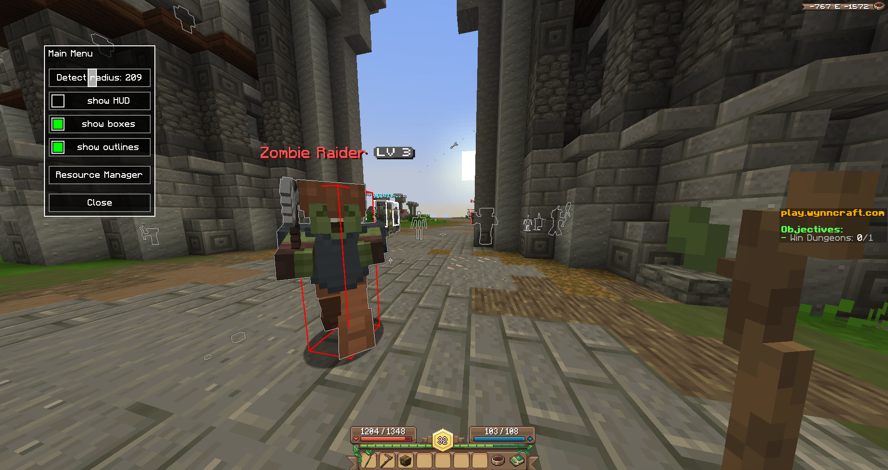
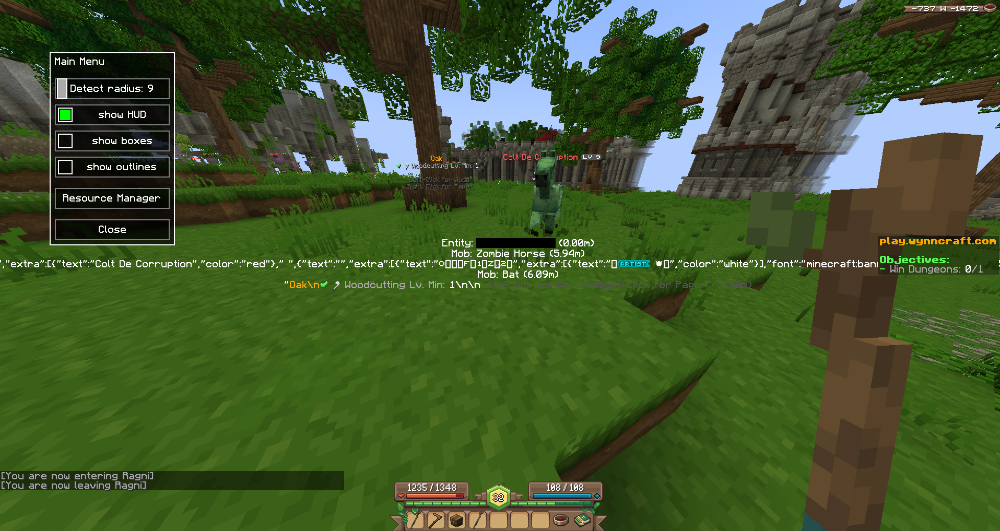
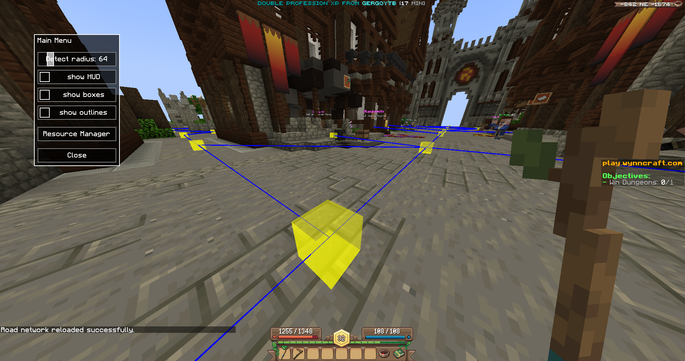
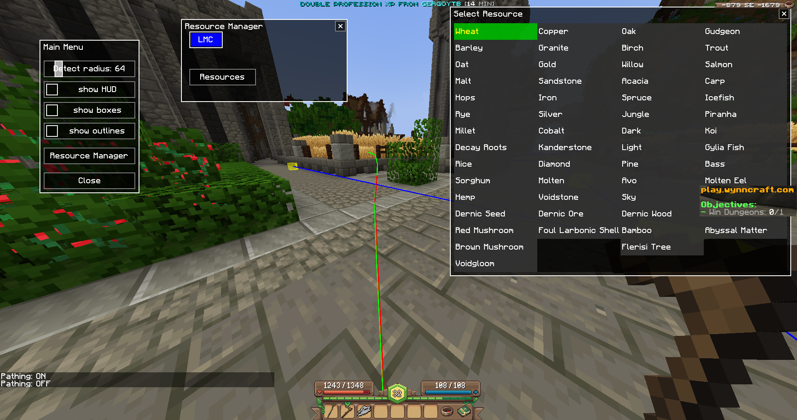
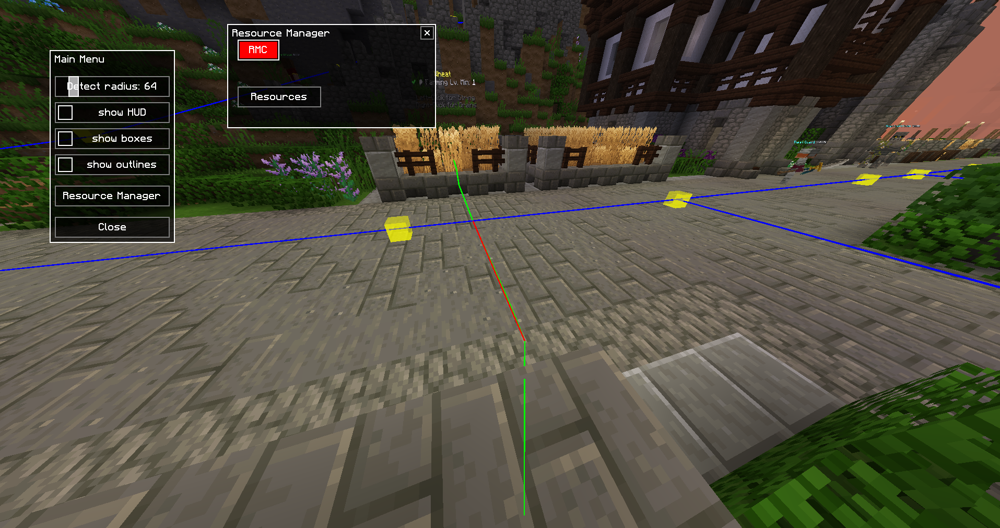
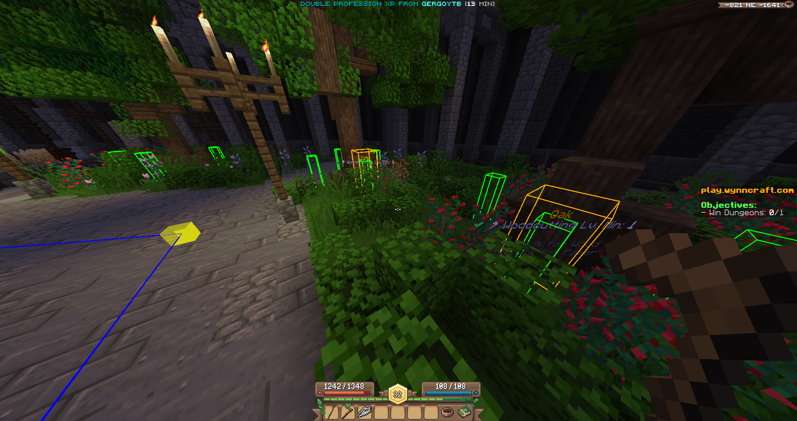
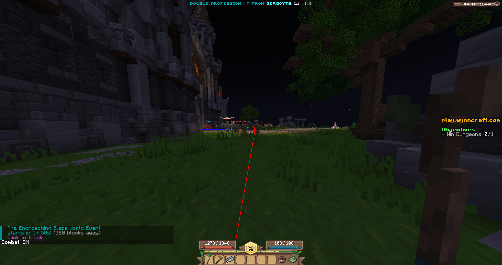
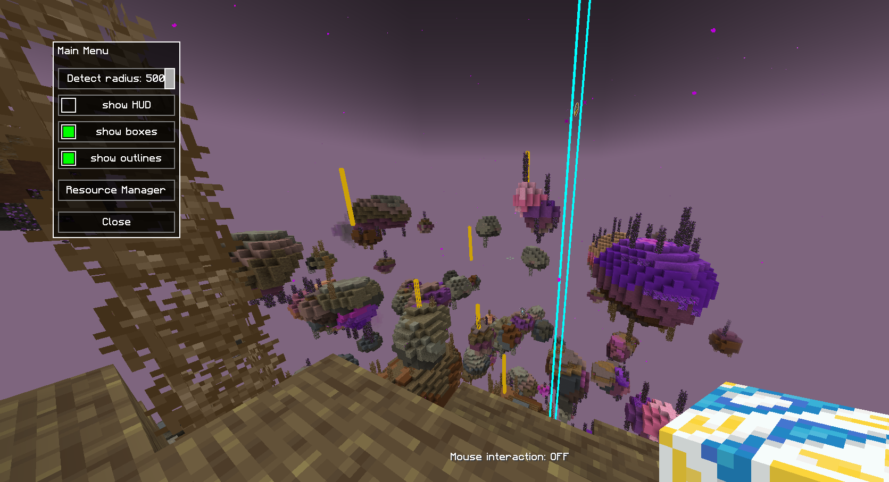
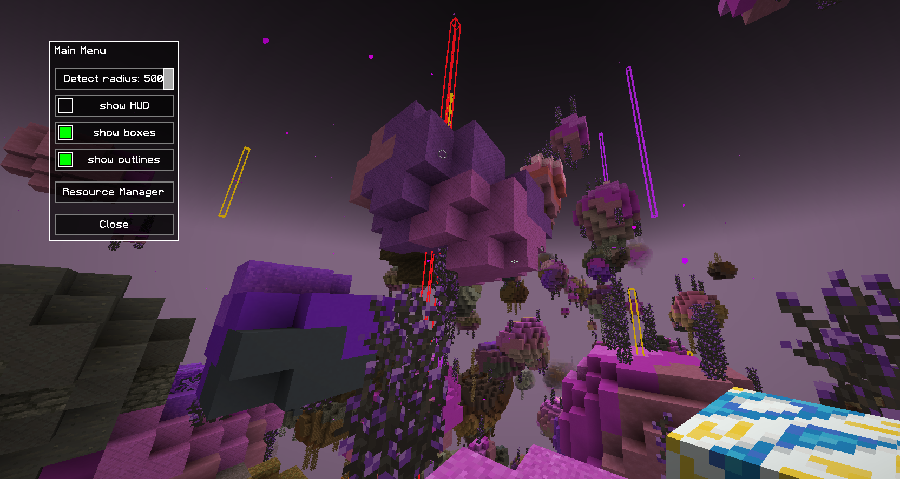
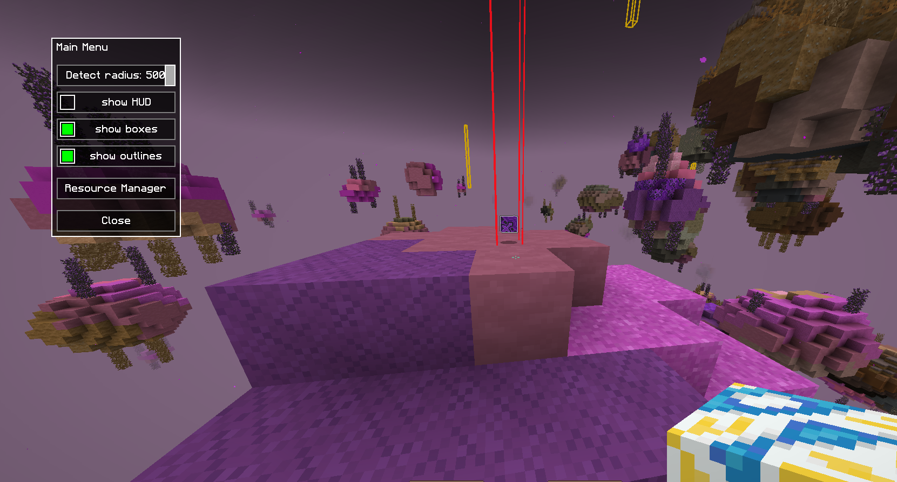

<table>
  <tr>
    <td width="50%" align="center">
      
    </td>
    <td width="50%" align="center">
      
    </td>
  </tr>
  <tr>
    <td width="50%" align="center">
      
    </td>
    <td width="50%" align="center">
      
    </td>
  </tr>
  <tr>
    <td width="50%" align="center">
      
    </td>
    <td width="50%" align="center">
      
    </td>
  </tr>
  <tr>
    <td width="50%" align="center">
      
    </td>
    <td width="50%" align="center">
      
    </td>
  </tr>
  <tr>
    <td width="50%" align="center">
      
    </td>
    <td width="50%" align="center">
      
    </td>
  </tr>
</table>

💡 Pro Tip

    Write /stream in chat to toggle on stream mode. This prevents other players from seeing your movements, as the bot's pathing may not always appear human-like.

✨ Features
General Rendering & Information

    Mob Detection: Detects mobs within a configurable radius.

    Entity Outlines: Highlights all entities with a toggleable outline (key.wynn_ai.toggle_outline).

    Entity List HUD: Displays a list of nearby entities (key.wynn_ai.toggle_hud).

    NBT Inspector: View the NBT data of an item in your hand or a specific slot.

        /nbtinfo hand

        /nbtinfo slot [slot_id]

Item & Resource Visualization

    ✨ Outer Void Item Boxes: Renders boxes around items dropped in the Outer Void.

        Toggle boxes on/off with key.wynn_ai.toggle_boxes.

        Toggle outlines on/off with key.wynn_ai.toggle_outlines for better visibility up close.

        Customize box appearances in itemconfig.json.

    Text Display Boxes: Draws configurable boxes around any TextDisplayEntity.

        Toggle with key.wynn_ai.toggle_boxes.

        Customize in boxconfig.json.

    Resource Node Caching: Saves the locations of resource nodes to display them (as small green boxes) even from far away. (6.png)

In-Game Menu HUD

The menu provides a centralized place to control the mod's features.

    Open/Close Menu: key.wynn_ai.toggle_HUD_menu

    Interact with Menu:

        Press key.wynn_ai.toggle_interaction_mode to toggle mouse control.

        Hold key.wynn_ai.hold_interaction_mode for temporary mouse control.

    Menu Features:

        Adjust detection radius for mobs and render distance for boxes.

        Toggle the visibility of the Entity List HUD, boxes, and outlines.

        Resource Manager:

            Right-click (RMC) or Left-click (LMC) on a resource while gathering.

            Resources: select resource to gather.

        Customizable: Create your own windows with widgets from packet menus.widgets by editing menuhudconfig.json.

    Warning: If you close all menu windows, pressing the toggle key will spawn the default menu. If you move a window off-screen, you will need to restart Minecraft to reset its position.

Automation
Auto-Gathering (key.wynn_ai.toggle_path)

    Automatically runs from node to node, harvesting resources.

    Triggers auto-repair when tool durability is low.

    Current Support:

        ✅ Farming & Mining (may struggle with ore nodes on walls, can stack in barrier blocks after farming)

        ❌ Fishing: Requires adding fluid support to BasicPathAI.java and PathFinder.java (A algorithm).*

        ❌ Woodcutting: Currently attempts to harvest all 4 nodes of a single tree (6.png), even on cooldown. Needs an improved verifyHarvestSuccess() method in HarvestPathManager.java.

    Warning: If a resource is too far away or a path cannot be found, the bot will continuously try to find one, which can cause significant lag. Use the toggle key to turn it off if this happens.

Auto-Repair

    This feature is always on.

    Autorepair if any tool below toolDurabilityThreshold (hardcoded in RepairStateManager.java to 5 durability)

    Automatically travels to a Blacksmith to repair any tool that falls below a durability threshold (hardcoded to 5 in RepairStateManager.java).

    Notes:
        
        If Blacksmith not in near chunks, write /rn reload, so it could use Highway Node Travel System.

        Support for repairing multiple tools at once has not been tested.

🗺️ Highway Node Travel System

Setup & Installation

To use a pre-configured road network or to share your own, you need to place the road_network.json file in the correct game folder.

    1. Get the road_network.json File
    
        Download the `road_network.json` file from this repository. You can find it inside the `run/config/wynn_ai/` directory or by clicking [this direct link](https://github.com/kitu451/wynn-ai-public/blob/main/src/main/run/config/wynn_ai/road_network.json?download=true).
    
    2. Find Your Minecraft Config Folder
    
        Launch Minecraft and go to the main menu.

       Press Escape -> Options... -> Resource Packs...

        Click the Open Pack Folder button. This will open your computer's file explorer.

    3. Navigate to the Correct Location

        In the file explorer window that just opened, you will be inside the resourcepacks folder.

        Navigate up one directory. You should now be in your main Minecraft installation folder (the one that contains resourcepacks, saves, mods, etc.).

    4. Place the File

        Look for a folder named config. If it doesn't exist, create it.

        Open the config folder.

        Inside config, look for a folder named wynn_ai. If it doesn't exist, create it.

        Place the road_network.json file you downloaded in Step 1 into this wynn_ai folder.

            Final Path Check: The final location for the file should look like this:
            .../.minecraft/config/wynn_ai/road_network.json

            Note: You might also see a file named resource_nodes.json in this folder. That file is automatically generated by the mod in-game when resources are cached and is separate from your highway network configuration.

Use the /rn or /roadnode command to create and manage a custom travel network.
Commands List

    Add Nodes:

        /rn add [id] [center] or /rn add [center] [id]: Adds a node named [id] at your current block position.

        /rn add [center]: Adds a node with a random UUID at your current block position.

        /rn add [id]: Adds a node named [id] at your exact Vec3d position.

        /rn add: Adds a node with a random UUID at your exact Vec3d position.

        /rn add [id] [x] [y] [z]: Adds a node named [id] at the specified coordinates.

    Remove Nodes:

        /rn remove [<node_id>]: Removes the specified node.

        /rn remove [nearest] [<radius>]: Removes the nearest node within a 5-block (or specified) radius.

    Connect Nodes:

        /rn select1 [<id>|<nearest>]: Selects the first node to connect.

        /rn select2 [<id>|<nearest>]: Selects the second node.

        /rn connect: Connects the two selected nodes.

        /rn connect last: Connects the last two nodes that were added in the current session.

        /rn disconnect: Disconnects the two selected nodes.

    Management & Info:

        /rn info [<id>]: Shows info for the nearest or specified node.

        /rn list [<radius>]: Lists all loaded nodes within an optional radius.

        /rn settype [<id|nearest>] [type_name]: Sets a custom type for a node.

        /rn save: Saves the current road network to JSON.

        /rn reload: Deletes all unsaved changes and reloads the network from JSON.

    Path Testing:

        /rn testpath [x] [y] [z] [drive]: Builds a path to the target coordinates. If drive is specified, the bot will follow the path. 
        (to stop moving quickly torn on and off Harvesting (key.wynn_ai.toggle_path))

        /rn testpath clearpath: Clears the visualized path (does not stop the drive command).

        /rn help: Shows this command list in-game.

🚧 Known Issues & Limitations

    Pathing Logic:

        /rn testpath ... drive uses a smooth Catmull-Rom spline path (startHighwaySplinePath).

        Auto-Repair uses a simple node-to-node path (startGeneralPath), which may struggle with tunnels.

    Tunnels: No in-game support for setting "targetTunnelExitNodeId" on nodes. This must be done manually in the JSON file (see nodes 134 -> 136, 135 -> 133 for an example).

    Travel Methods: No support for teleportation scrolls, V.S.S. Seaskipper, or horse travel in NavigationService.java.

    Combat System: (key.wynn_ai.toggle_combat)

        The task system (placeholders for now) should switch from gathering to combat when mobs are near, but this is not yet implemented.

        CombatMovementStrategy, CombatManager, and CombatController are placeholders and work poorly. (7.png)

## Development Process & AI Collaboration

This mod, WYNN AI, was developed by natga999.

A significant portion of this project was developed with the extensive assistance of various AI language models, which served as powerful tools for brainstorming, code generation, API understanding, debugging complex issues, and providing architectural guidance. This collaborative approach with AI significantly accelerated development and helped in tackling intricate features.

The specific contributions and areas where AI provided notable assistance include:

*   **Google's Gemini (Gemini 2.5 Pro via web AI Studio):**
    *   Conceptualization and refinement of the Combat System.
    *   Design and implementation details for the Long-Distance Road Network, including `RoadNode`, `RoadNetworkManager`, and `LongDistancePathPlanner`.
    *   Detailed state machine design and GUI interaction logic for the `RepairStateManager`.
    *   Development of the `HighwaySplineStrategy` for smooth path following.

*   **OpenAI's ChatGPT (models GPT-4o and GPT-o4-mini):**
    *   Initial project setup and most of the structure.
    *   Core A* pathfinding logic in `PathFinder`.
    *   Rendering systems (`PathRenderer`, `RoadNetworkRenderer`).
    *   Development of `BasicPathAI` and its movement mechanics.
    *   Guidance on Fabric Mixins.
    *   Assistance with menu interactions and widget handling.
    *   Development of most manager classes and input handling.

*   **DeepSeek Coder:**
    *   Provided assistance with specific aspects of the A* algorithm and `BasicPathAI` refinements.

*   **Anthropic Claude (Claude 3.7 Sonnet):**
    *   Used for general code-related questions, getting different perspectives on existing problems to find new solutions, and assistance with minor fixes or refactoring.

This transparent acknowledgement reflects the modern development landscape where AI tools are becoming integral partners in the creative and technical process.